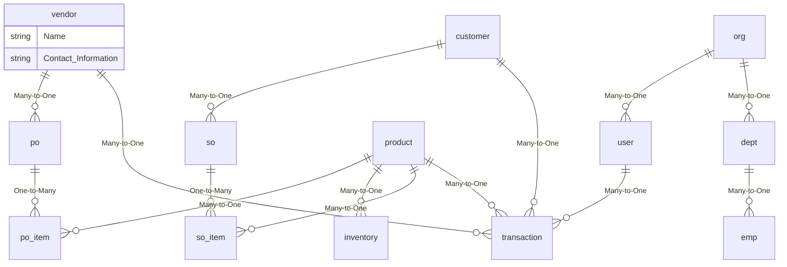

# typescript-crud
crud using typescript and bootstrap

## mermaid

~~~mermaid
flowchart TD
    A[Start] --> B{Is it?}
    B -- Yes --> C[OK]
    C --> D[Rethink]
    D --> B
    B -- No ----> E[End]
~~~

- doc: [http://mermaid.js.org/syntax/flowchart.html]
- [https://www.mermaidflow.app/]

- another:

~~~mermaid
erDiagram
    // Define entities
    User as "User"
    Department as "Department"
    Product as "Product"
    SaleOrder as "SaleOrder"
    Inventory as "Inventory"

    // Define entity attributes
    User {
        +UserID (PK)
        UserName
        Password
        FirstName
        LastName
        Email
        Role
    }

    Department {
        +DeptID (PK)
        DepartmentName
        Location
    }

    Product {
        +ProductID (PK)
        ProductName
        Description
        UnitPrice
    }

    SaleOrder {
        +OrderID (PK)
        OrderDate
        CustomerName
        TotalAmount
    }

    Inventory {
        +InventoryID (PK)
        ProductID (FK)
        QuantityInStock
    }

    // Define relationships
    User --|{ Belongs to }|-- Department : WorksIn
    User --|{ Created by }|-- SaleOrder : Created
    SaleOrder --|{ Contains }|-- Product : Includes
    Product --|{ Managed by }|-- Inventory : ManagedBy
~~~

## another

~~~mermaid
mindmap
  root((Products))
    Origins
      Food
      ::icon(fa fa-book)
      Clothes
        Products
    Logistic
      On effectiveness and features
      On Automatic creation
        Uses
            Warehouse 1
            Point of Sale
            Human Capital
    Tools
      Workforce and machines
      Other Tools
~~~

~~~mermaid
---
title: Order example
---
erDiagram
    CUSTOMER ||--o{ ORDER : places
    ORDER ||--|{ LINE-ITEM : contains
    CUSTOMER }|..|{ DELIVERY-ADDRESS : uses
~~~

